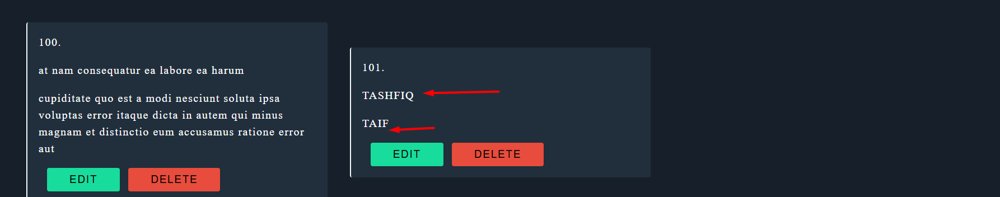
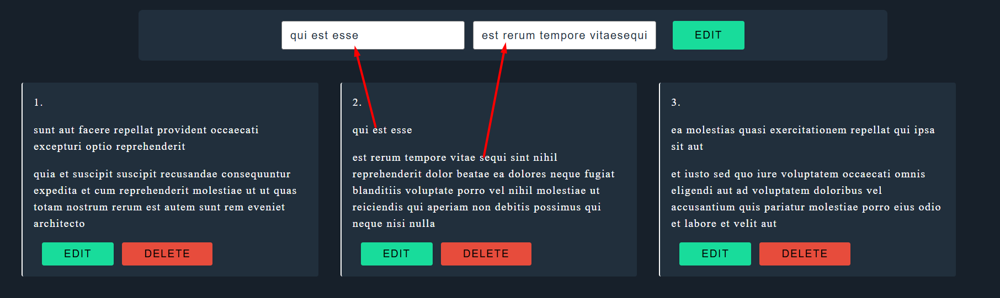
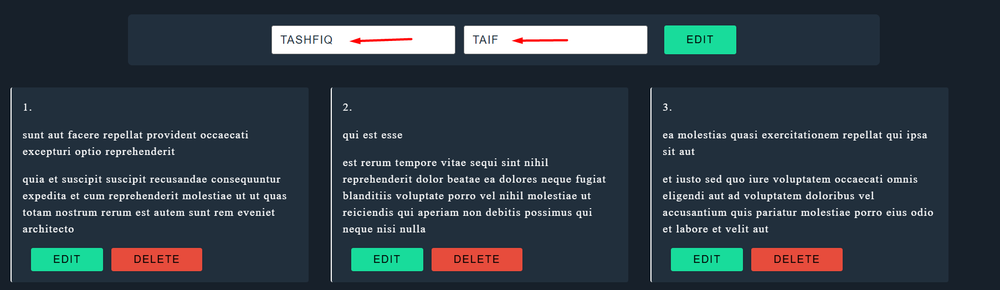
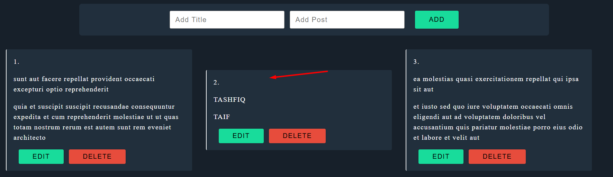
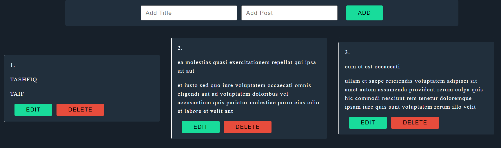
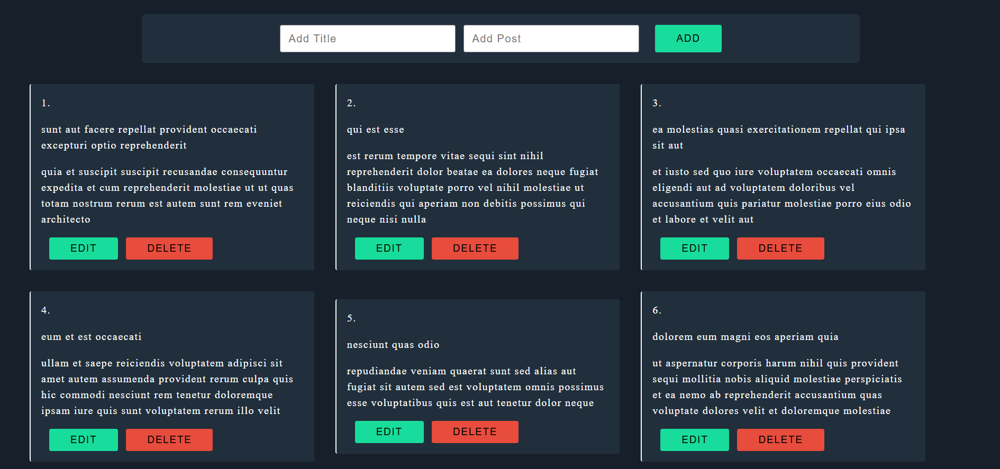

# 📘 Axios CRUD Operation - React App

A simple yet functional React app demonstrating full **CRUD operations (Create, Read, Update, Delete)** using **Axios** and the `https://jsonplaceholder.typicode.com/posts` API.

🚀 **Live Demo**: [axios-crud-operation-project.netlify.app](https://axios-crud-operation-project.netlify.app/)  
📁 **API Used**: [JSONPlaceholder](https://jsonplaceholder.typicode.com/posts)

---

## ⚙️ Features

- ✅ **Read**: Fetch and display posts from the API.
- ➕ **Create**: Add new posts with a title and body.
- ✏️ **Update**: Edit existing posts inline with input fields.
- ❌ **Delete**: Remove posts with a single click.
- 📄 **Form State Management**: Smart handling of form input values for adding or editing.
- ⚡ **Real-Time UI Update**: Updates UI immediately after API responses.

---

## 📂 Project Structure

```
src/
│
├── api/
│   └── PostApi.js      # Axios setup and all CRUD functions
│
├── components/
│   ├── Form.js         # Input form for adding/editing posts
|   └── Posts.js         # Main post manager and data state
│   └── PostList.js     # UI for each post with edit/delete
│
├── App.css             # Styles

```

---

## 📸 Screenshots

> 🟢 Add Post  


> 🟢 Edit Mode (Step 1 - Select Post)  


> 🟡 Edit Mode (Step 2 - Form Filled)  


> ✅ Updated Post  


> ❌ Delete Post  


> 📥 Fetched Data  


---

## 🛠️ Technologies Used

- ⚛️ React
- 🌐 Axios
- 📡 REST API (JSONPlaceholder)
- 🎨 CSS

---

## 🧪 How to Use

### 1. Clone the Repository

```bash
git clone https://github.com/TASHFIQ01791/axios-crud-operation-react.git
cd axios-crud-operation-react
```

### 2. Install Dependencies

```bash
npm install
```

### 3. Run the App

```bash
npm start
```

---

## 📁 API Methods Used

```js
GET     /posts        // Fetch all posts
POST    /posts        // Create new post
PUT     /posts/:id    // Update a post
DELETE  /posts/:id    // Delete a post
```

---

## 📧 Author

- **Tashfiq Ahmed**
- 🔗 [GitHub Profile](https://github.com/TASHFIQ01791)

---

## 🙌 Acknowledgements

- [JSONPlaceholder](https://jsonplaceholder.typicode.com) for free fake API.

---

## 📜 License

This project is open source and available under the [MIT License](LICENSE).
